# Physically Based Rendering

"Physically based rendering (PBR) refers to the concept of using realistic shading/lighting models along with measured surface values to accurately represent real-world materials."


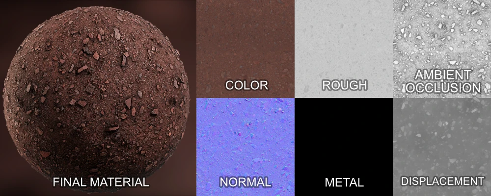
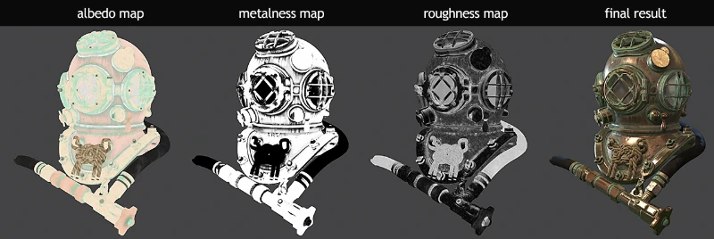

Useful resources:

- [Physically Based Rendering and You Can Too!](https://marmoset.co/posts/physically-based-rendering-and-you-can-too/)
- [Basic PBR theory](https://marmoset.co/posts/basic-theory-of-physically-based-rendering/)

# Color

Commonly called Albedo (diffuse in older systems), represents the objects "true" color. The texture map should only contain plain base colors and not any lighting/shading information (shadows, occlusions, highlights etc.) since the shading will be calculated by the renderer.

Albedo color values usually lies in the midtones of the color range. Albedo values should **not be 100% white or 100% black**.

- Dielectrics/non-metals range from ~`60` (coal) to ~`240` (snow) in sRGB.
- Metals range from `180` to `250` in sRGB.

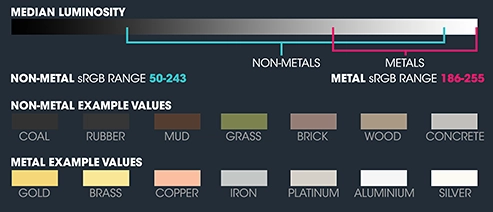
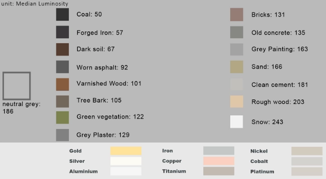

## Roughness

Roughness defines how rough or smooth the surface is. Rough surfaces scatter the light in more directions than smooth surfaces, which make reflections blurry rather than sharp. The value range is from `0.0` to `1.0`. When Roughness equals `0.0`, reflections will be sharp. When Roughness equals `0.5`, reflections will become blurry.

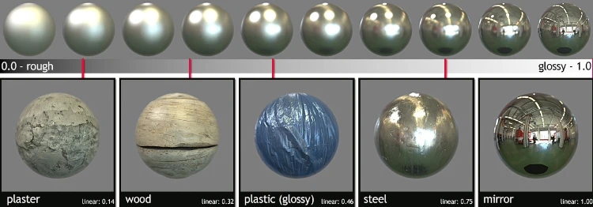

Some models use Gloss/Glossiness which is simply the inverse of roughness (inverted values).

## Metallic

Corresponds to whether a surface is dielectric (non-metal) or conductive (metal). Values range from `0.0` (non-metal) to `1.0` (metal).


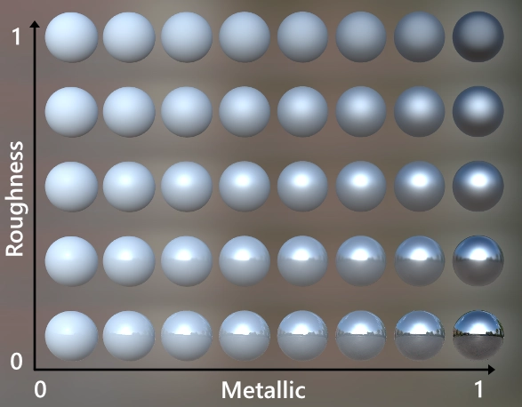

## Ambient Occlusion

Optional texture that provides additional information on low-frequency occlusion shadowing.

Makes objects with crevices look more realistic by adding shadows to occluded areas. Occlusion value range from `0.0` to `1.0,` where `0.0` means darkness (occluded) and `1.0` means no occlusions.

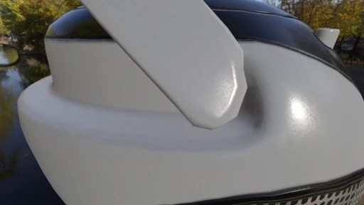

Sometimes an additional "cavity" is used to provide additonal information on high-frequency occlusion shadowing.

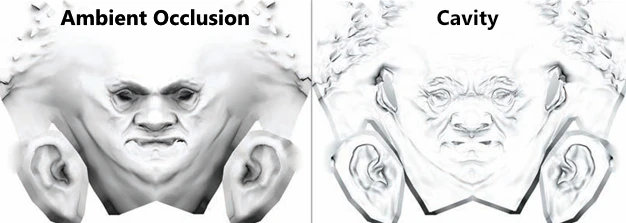

## Normal Map

Contains surface normal vectors which can be used to modulate the surface normals of a model in order to fake shading of bumps and surface details.

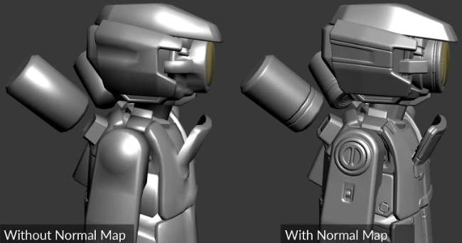

Normal maps have an iconic light-blue color (or brownish-yellow in certain engines that discard the z-channel).

It might be worth noting that OpenGL uses Y+ and DirectX uses Y- and it is thus sometimes necessary to invert the Y/green channel depending of for which API the normal map was authored for.

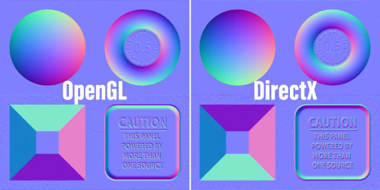


## Height

Also known as displacement or bump maps.

Grayscale texture which provide height information (usually 0.5 being no height difference, 0-0.5 = decrease in height, 0.5-1 = increase in height).

Can be used to generate a normal map, view offsets in parallax occlusion mapping or to displace vertex positions.

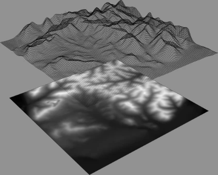


## Color Space Conversion

```
sRGB = ((Linear / 255) ^ (1 / 2.2)) * 255
```

```
Linear = ((sRGB / 255) ^ 2.2) * 255
```
