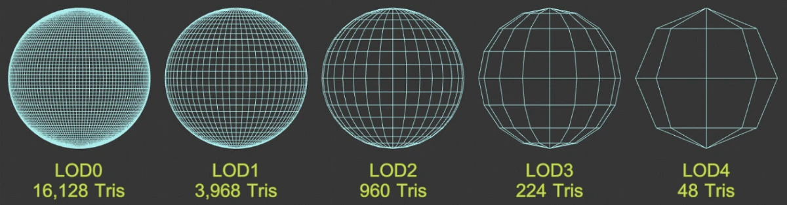
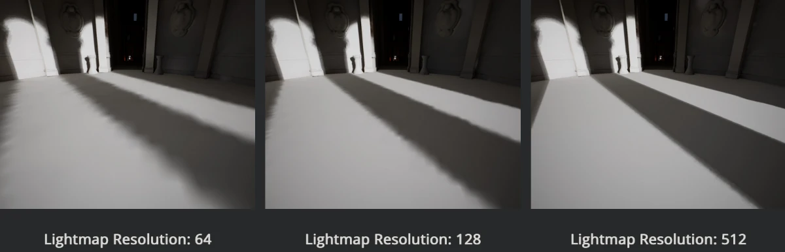
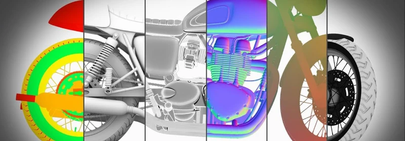
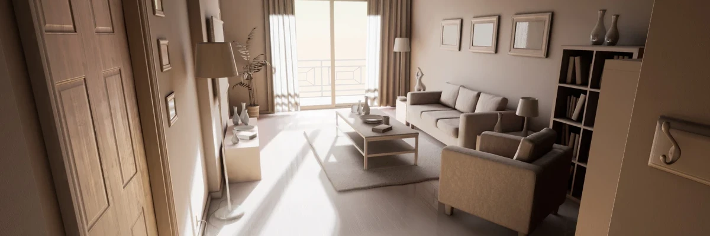
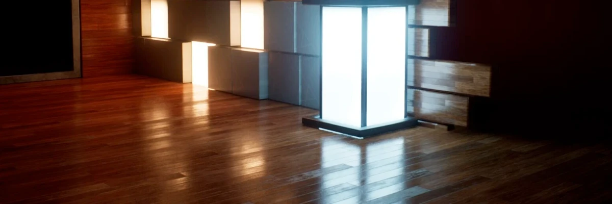
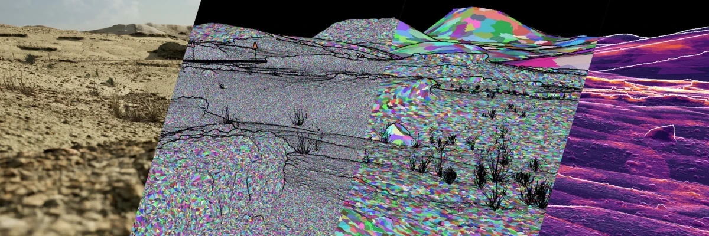
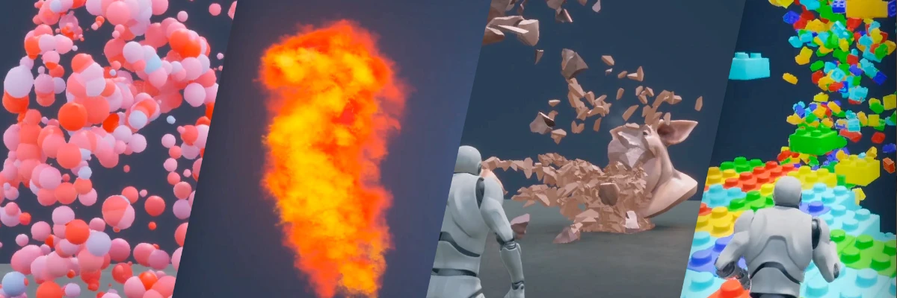

# Terminology

## Common Terms

- **LOD** - _"Level of Detail"_. As the player camera moves further away from a model, the model will cover less and less screen-space area. As there's no point in having a very complex model taking up a small amount of pixels on screen, it's common to swap the model with LOD-models as the player moves further away from a model. LOD meshes are indexed with a zero-based system, where the regular high quality model is LOD-0 and as the LOD level number increases, the models have progressively less geometry details and fewer polygons. Thus a LOD-3 mesh will have less detail than LOD-1. 
- **Lightmap** - Lighting, indirect-lighting and shadows pre-computed and saved as a texture. Very efficient as the lighting computations are done only once while building the level/game instead of at runtime/real-time. Lightmaps can yield very high quality lighting but are limited by texture resolution/GPU memory and are static which means the shadows/lights are not updated when dynamic objects move around a scene.  \
Unreal have systems (Indirect Lighting Cache/Volumetric Lightmaps) that allows dynamic object to sample the lighting information of the nearby lightmap which is interpolated and yields a decent approximation. This will very likely be the approach we will use for the project.
- **Baking** - The process of saving information related to a 3D mesh into a texture file (bitmap). Most of the time this process involves projecting/transferring information from another mesh. 

## Unreal Engine 5

- **Actor** - Any object that can be placed into a level (such as a Camer or Static Mesh) and support 3D transformations _(such as rotation, scaling and translation)_.
- **Component** - A piece of functionality that can be added to an Actor. _(e.g. an Audio Component will let an Actor play sounds)_. Components must be attached to an Actor and can't be exist or be placed into a level by themselves.
- **Blueprint** - 
- **Brush** - An actor that describes a certain type of 3D object shapes. Brushes are useful for creating simple block-outs of levels (though they are not recommended for final designs). Brushes also known as _Binary Space Partitions_ or BSP brushes.
- **Volumes** - Bounded 3D spaces that have different uses depending on the effects attached to them. Examples:
  - _Blocking Volumes_ are invisible and used to prevent Actors from passing through them. 
  - _Trigger Volumes_ cause events to trigger when an Actor enters/exits them.
  - _Post Processing Volumes_ apply various visual effects while a camera is within its bounds.
- **Levels** - (also called maps) are scenes that contains everything that can be seen or interacted with. UE5 saves each level as a separate `.umap` file.
- **World** - A container for all levels that handles common settings, content streaming/loading and creation of dynamic actors.
- **Static Mesh** - 3D models created in external applications and imported into Unreal. The basic unit used to create geometry for levels and makes up the vast majority of a level.
- **Proxy geometry** - A way to combine multiple Static Meshes and their materials/textures into a single Static Mesh with one single material/texture set with reduced polygon count. They can be used as to substitute the original meshes in scenarios where reduced quality is an acceptable tradeoff, such as a using the proxy in shadow calculations to improve runtime performance at the cost of memory and asset processing.
- **HLOD** - "Hierarchical Level of Detail", Unreals LOD system that combines usage of LOD and Proxy meshes.
<!-- TODO: Actor-Component hierarchy example -->

### Unreal systems and tools

Unreal has a few systems that have been given non-descriptive/esoteric names. A couple of the relevant ones are described below.

- **Lightmass** - Lightmap baker that offline-computes lighting (including indirectlighting/global illumination and ambient occlusion) and saves the result as a a lightmap/shadowmap texture. It's a slow process, but can yield high quality (but static) lighting.

- **Lumen** - A realtime reflections and GI (global illumination) lighting solution. Significantly more expensive performance-wise and less accurate than lightmass, but has the benefit of supporting GI in dynamic scenes.

- **Nanite** - A dynamic level-of-detail system that allows scenes to contain extremely high-polygon count objects which are optimized and streamed behind the scenes, dynamically adjusting the detail of the objects depending on the distance of the player camera. It has a few drawbacks and limitation and is mostly suitable for static environment pieces with a lot of intricate details, such as cliffs, rocks or statues. It's not really applicable to our project.

- **Niagara** - Particle and VFX system. Allows for the creation of complex particle systems and visual effects using node-based components.

There's a few more systems that you might encounter but which we are unlikely to need or use in this project:

- **Chaos** - Destruction physics for large-scale real time destruction.
- **APEX** - System that can be used to create destructible meshes and cloth simulations.
- **UMG** - UI Editor for creating UI/HUD elements, menus or graphical interfaces.