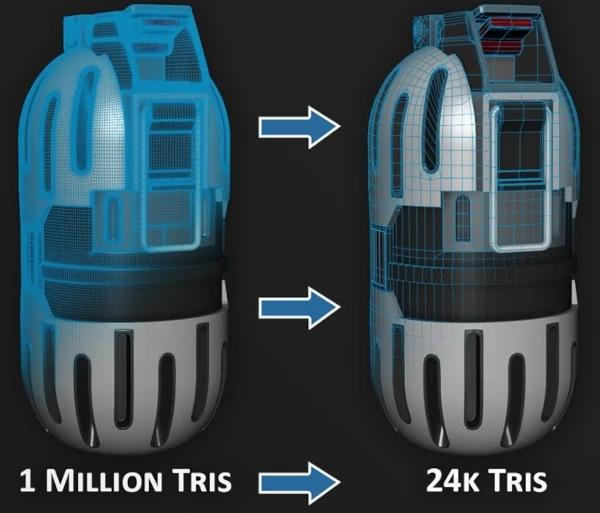
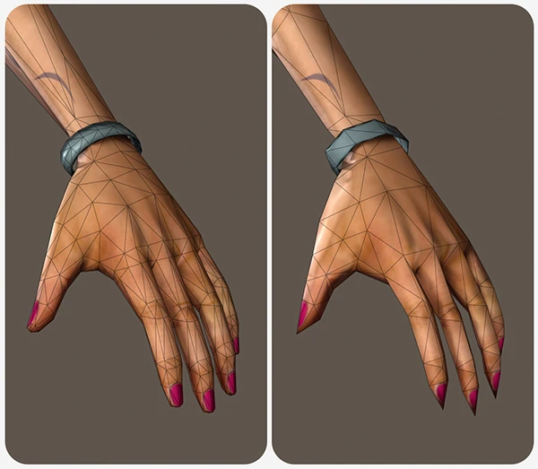
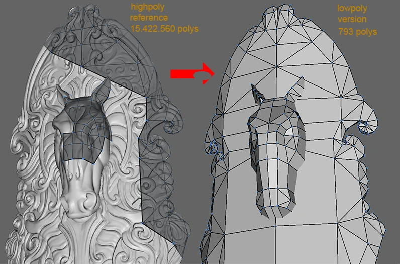
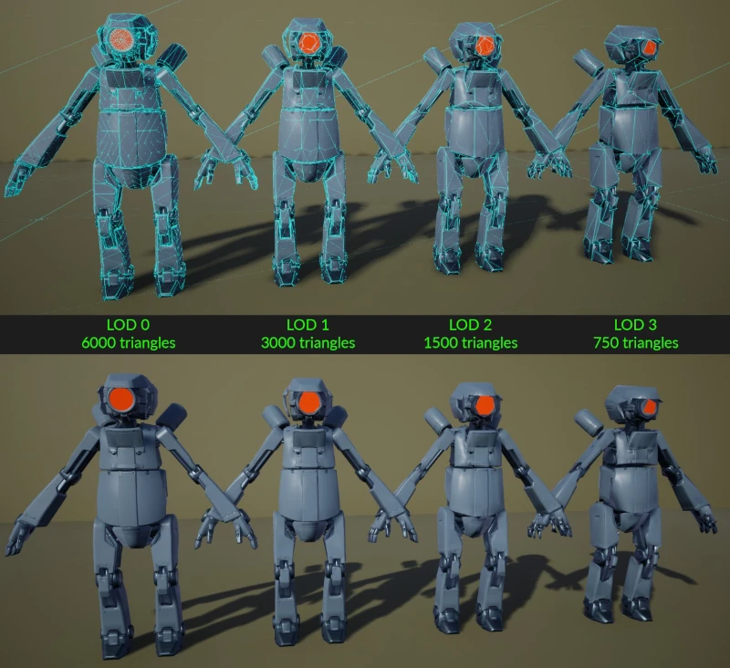
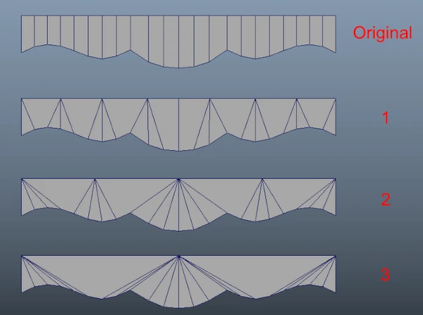
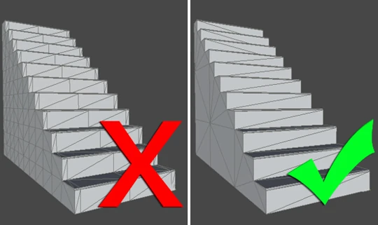
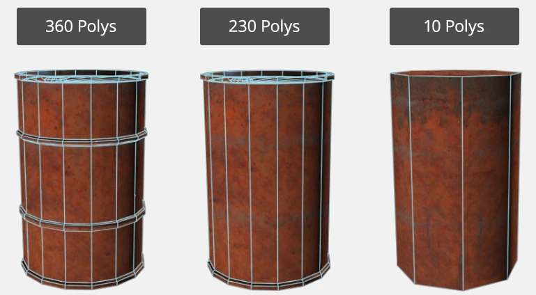
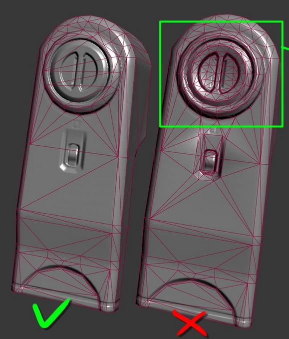

# Modeling

When creating models for real-time applications, it's important to try and reduce the polygon count as much as possible while maintaining the silhouette of the model.

It's fine to first model a high resolution model and then reduce the amount of polygons before exporting the model to the game engine. 

It's common for artist to create a very high-polygon count sculpture which they then use to create a low-polygon model which can be rendered in-game.

## Tips

- Remove as many polygons as possible while maintaining a recognizable shape. Many small triangle details on a 3D object will not actually be visible on the games final screen, due to combination of screen size and placement of these 3D objects in the game. The amount of detail will depend on its size and distance from the player. It's important to periodically test and make sure the model shape is recognizable in the game engine. 
- Remove/merge vertices that do no contribute to the model shape  
- Remove small and polygon-dense details. The scale of the models needs to be taken into consideration when creating details
  _(in the example below, a baked normal map is used to fake the details where the polygon details is removed)_ \
\

- The game engine will convert all quads and n-gons of the final model to triangles. You can sometimes achieve better shading by doing this manually.