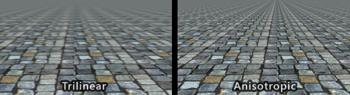

# Texturing

- As per Epic's recommendations, use .png, .tga, tif or .psd; **Do not save uncompressed images as .jpg**
- Textures must have pixel dimensions that are powers of 2. 
    - A texture may be non-square/rectangles, but the width and height still have to be powers of 2
- Textures dimensions should be as small as possible and their dimensions should not exceed `8129x8292` pixels.
- As a rule of thumb, if you double the dimensions of a texture, it's file-size increases ~4x (exact size depends on image format, compression, etc)
- For the sake of simplicity we will avoid using channel packed textures since it is more error prone and also harder to author using conventional tools
- In the case where an alpha mask/channel is needed, it's fine to include it in the color map instead of authoring a dedicated alpha texture

Valid texture sizes:

| Dimension | Power of 2 | DXT1 size |
|-----------|------------|-----------|
| 16        | 2^4        | 312 b     |
| 32        | 2^5        | 824 b     |
| 64        | 2^6        | 2.8 kb    |
| 128       | 2^7        | 10.8 kb   |
| 256       | 2^8        | 42.8 kb   |
| 512       | 2^9        | 170 kb    |
| 1024      | 2^10       | 682 kb    |
| 2048      | 2^11       | 2.66 mb   |
| 4096      | 2^12       | 10.6 mb   |
| 8192      | 2^13       | 42.6 mb   |

## Color Spaces

Since certain textures contains colors and other contains vectors or scalar values, it's important to handle their color space properly. 

`sRGB` images are [gamma corrected](http://en.wikipedia.org/wiki/Gamma_correction) when viewed on a monitor. This transformation is undesired for scalar value which should instead be saved and treated as `linear` values.

Texture maps such as metallic and roughness does not contain colors but 0-1 values that are used to control material properties and should therfore be treated as `linear`.

Normal maps contains normal vectors and not actual colors. Gamma correcting normal maps changes the normal vectors and will result in incorrect results. Normal maps should thus also be `linear`.

- `linear`: No gamma correction
- `sRGB`: Gamma correction

| Texture type      | Color space | Note                                          |
|-------------------|-------------|-----------------------------------------------|
| Color (Albedo/Diffuse)     | sRGB        | Contains colors and should be gamma corrected |
| Normal            | Linear      | Contains normal vectors and not colors        |
| Roughness         | Linear      | Contains linear grayscale values 0-1          |
| Metallic          | Linear      | Contains linear grayscale values 0-1          |

## Texture Filtering

**Anisotropic filtering** is very cheap on modern hardware and results in sharper texture filtering than plain **Bilinear**/**Trilinear** filtering. Prefer Anisotropic filtering `4x`/`8x` whenever possible. `2x` is usually a bit to low while there's diminishing returns at `16x`.

