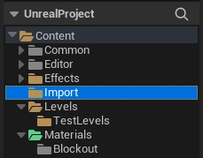
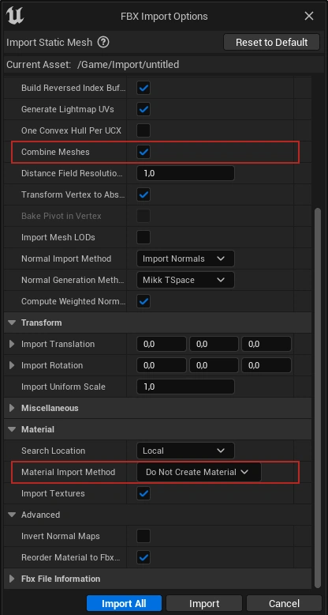

# Workflow

## 1.1. Asset Creation Workflow

1. **Create a new folder for the asset working files in the `TNM061 Projekt\Production\ContentSource\<yourname>` folder**
1. **Gather references**
    - Look up the dimensions of the object. For furniture and similar objects, IKEA is a good source of reference for dimensions. 
    - Search for and find images of the object you are going to model that shows it from multiple angles. 
    - [PureRef](https://www.pureref.com/) is a very handy tool for collecting references
2. **Create a base mesh/model**
    - A base mesh captures the overall shape and silhouette of the object but does not have a lot of details. A model "sketch"
3. **Export the base mesh and import it in Unreal Engine**
    - See "**Export the mesh and import it in Unreal Engine**" point below for importing details
    - It's important to check that the model have proper proportions and dimensions compared to the other objects within the engine
    - Make any required scale corrections outside of Unreal Engine (in Maya/3DS Max/Blender)
4. **Finalize the model**
    - Add in any remaining details and start optimizing the model by reducing unecessary geometry that does not contribute to it's silhouette or shape (such as redundant edge loops)
    - Make sure to **ajust the origin of the mesh**. Either place it at the center of the mesh, the center of the bottom section of the mesh or at a corner of the mesh bounding box. Otherwise snapping, rotation and translation becomes a hassle.
    - Apply any scale and/or rotation transformations if applicable
    - Join any non-moving mesh parts into a single mesh (or )
5. **UV-unwrapping**
    - Every model requires UV-maps to work properly with materials
6. **Triangulate the mesh** (Optional as Unreal does it for you, though it can sometimes result in shading artifacts)
7. **Export the mesh and import it in Unreal Engine**
    - Export the model as an `.fbx` file
    - Import the model by dragging the file into into the `Content\Import` folder
    
    - In the FBX importer, make sure to set **Material Import Method** as **Do Not Create Material**
        - If you have not merged all the parts of your model into a single mesh, make sure to select **Combine Meshes** to have Unreal do it during the import
    
8.  **Assign material(s)**
    - Create a material instance from the `Content\Materials\Templates\MT_PBR_Standard` for materials with textures. Use the `Content\Materials\Templates\MT_PBR_Untextured` for plain, untextured, materials.
    - Override the corresponding texture channels in the material instance with the assets texture maps
    - Click on the imported mesh/model to open up the **Static Mesh editor**. In the **Details -> Material Slots** panel, materials can be assigned to the mesh
9.  **Test placing the asset in a map**
    - There's a test level for testing assets in `Content\Levels\TestLevels\AssetLevel`
10. **Add the asset the `Placeable` folder**
    - Put the static mesh/model with the assigned material in the `Content\Placeables`
        - Rename the static mesh to
    <span class="convention"><span style="color: #d77c79;">[SM]</span>\_<span style="color: #e6a472;">[AssetName]</span></span>
    - Put the material instance in `Content\Materials`
        - Rename the material instance to
    <span class="convention"><span style="color: #d77c79;">[M]</span>\_<span style="color: #e6a472;">[AssetName]</span></span>
    - Put any textures in `Content\Textures`
        - Rename the material instance to
    <span class="convention"><span style="color: #d77c79;">[T]</span>\_<span style="color: #e6a472;">[AssetName]</span>\_<span style="color: #c0a7c7;">[TextureTypeSuffix]</span></span>
    - See [Naming conventions](../01_project/conventions.html) for full asset naming conventions
        

Suggested folder structure for working on an asset:

```
* ContentSource\<yourname>\AssetName:
|- Export          (exported model for Unreal Engine)
|- References      (reference images)
|- Models          (Maya/3DS Max/Blender project files)
|- Textures        (texture files if applicable)
```

## 1.2. Rough Project Outline

1. **Prototyping**
    - Layout concepting
    - Block-out environment
2. **Asset creation**
    - Inventory of required assets, division of labor
    - Asset creation (modeling, unwrapping, export/import)
3. **Environment assembly**
    - Replace block-out meshes with created assets
    - Lighting the level
    - Particles, interactive elements
    - Character/camera controller
4. **Content lock & review**
    - Evaluate environment, detail pass
    - Remove any prototype/block-out meshes
5. **Final preparations**
    - Lightmap preparation and baking [^lightmap_uvs]
    - Reflection Capture placement and baking
    - LoD generation [^lod_gen]
    - Proxy mesh generation [^proxy_gen]
    - Post-processing volumes [^post]
        - Color grading, Vignette
        - Exposure, Bloom, Light Shafts
        - SSGI, SSAO, SSR
6. **Render HQ frames with "Movie Render Queue"** [^render]

---

[^lightmap_uvs]: [Lightmapping in UE](https://docs.unrealengine.com/5.1/en-US/understanding-lightmapping-in-unreal-engine/)
- LightmassImportanceVolume placement
- Per mesh Static Mesh resolution (not overrides)
- Lighmass Portal placement

[^lod_gen]: [LOD generation](https://docs.unrealengine.com/5.1/en-US/static-mesh-automatic-lod-generation-in-unreal-engine/)

[^proxy_gen]: [Proxy mesh generation](https://docs.unrealengine.com/5.1/en-US/building-hierarchical-level-of-detail-meshes-in-unreal-engine/)

[^post]: [Post Processing](https://docs.unrealengine.com/5.1/en-US/post-process-effects-in-unreal-engine/)

[^render]: [Rendering HQ Frames](https://docs.unrealengine.com/5.1/en-US/rendering-high-quality-frames-with-movie-render-queue-in-unreal-engine/)