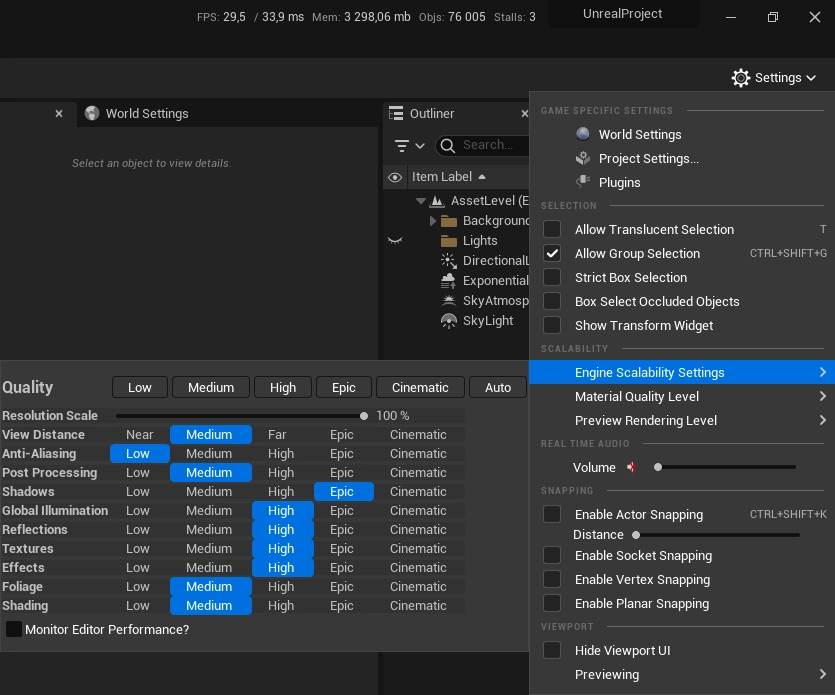
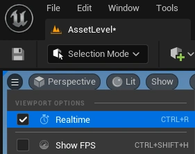
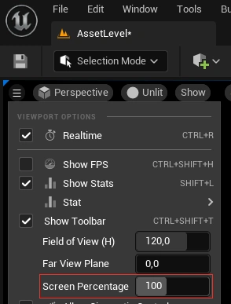
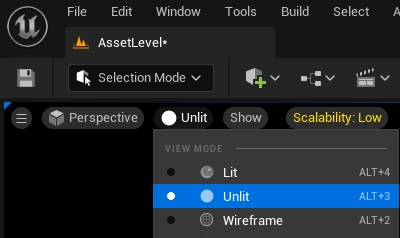
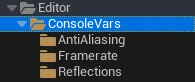
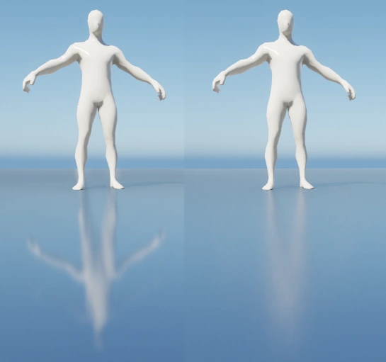
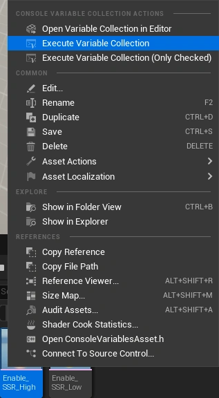

# Performance tweaks

## Scalability

You can tweak some of the generic quality settings under **Settings > Engine Scalability Settings**

In the picture below are some reasonable suggestions for the settings

Note that:
- Setting Textures too low will use low quality filtering/mip LODs which will cause blurry textures at higher distances and certain angles
- Setting Shadows too low will cause bleeding between walls/solid objects and shadow banding. However reducing shadows yield good performance gains
- Setting Reflections/Effects to Medium or below can disable Screen Space Reflections
 
## Viewport

Unchecking the `Viewport options -> Realtime` checkbox will stop unreal from rendering certain effects (such as the temporal component in TAA/TSR and reflections). Saves some performance, but causes some visual inconsistency compared to having it off.

Reducing the `Screen Percentage` slider to below 100% lowers the internal rendering resolution which can yield a significant performance boost. The viewport will become blurrier as the percentage is reduced. _(If anti-aliasing is set to TSR, UE will reconstruct the lower resolution viewport to native resolution)_

Switching `View mode` to Unlit/Wireframe will reduce the viewport rendering overhead. The `Visibility Collision` view mode is also more lightweight than Lit and in some cases provides better visuals than Unlit/Wireframe

## Macros

There's a couple of macros for configuring console variables in `Content/Editor/ConsoleVars`.

- **Framrate** limits the amount of frames rendered each second. Unreal has no upper bound, which greatly impacts the GPU/CPU usage. Using a limit of 30/60 FPS is fine for working in the editor
- **AntiAliasing** controls the smoothness of geometry edges and shader aliasing. 
    - `FXAA` will use a simple post-processing edge detection algorithm. Works fine for static geometric edges, but will cause shimmering during movement and does not resolve shadow/ray-tracing noise.
    - `TAA` will use motion vectors and information across multiple frames which takes care of aliasing and shimmering, but causes ghosting during fast movements.
    - `TSR` is similar to TXAA, but higher quality and also upscales/reconstructs the image to a higher resolution (noticable if `Viewport options -> Screen Percentage` is set to less than 100%)
- **Reflections** controls the Screen Space Reflections *(also requires effects set to High in the Scalability settings)*. They are enabled by default, but the "High" macro also enables variable roughness for the reflections, but also introduces some noise _(which anti-aliasing set to TAA/TSR should resolve)_ _(without variable roughness, materials will have sharper reflections than their roughness value might suggest)_

_(Comparison of reflections low (left) and high (right). Note the constant roughness vs varying roughness difference)_

To run a macro, right click and select **Execute Variable Collection** _(double-clicking it will run it and then open the console variable editor)_

