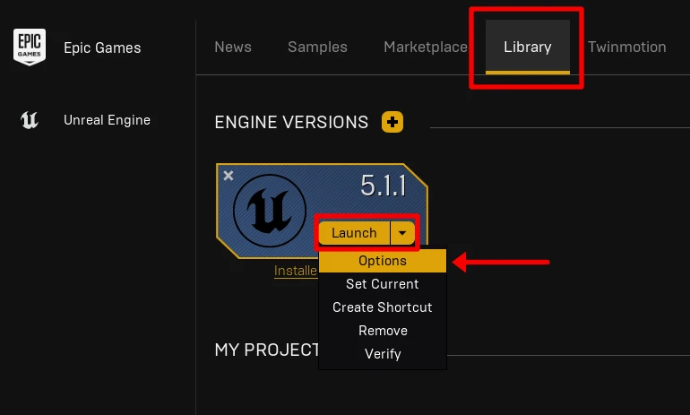
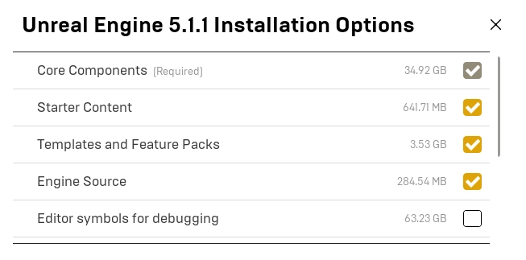

# Setup

## Prerequisites

### Graphics Card Drivers

It can be beneficial to update your graphics card drivers as new optimizations and features may require the latest drivers, and newer drivers might also provide bug fixes and solve various issues.

- [Download drivers for NVIDIA graphics cards](http://www.nvidia.com/Download/index.aspx)
- [Download drivers for AMD graphics cards](http://support.amd.com/us/gpudownload/Pages/index.aspx)

### External Dependencies

The UE5 installer (via Epic Launcher) ships with a prerequisites installer that includes the DirectX and Visual C++ redistributables required to run UE5.

The latest UE5 features require DirectX 12 and at minimum Windows 10 v1703, preferably Windows 10 v2004/20H2. If you have Windows Update set to automatically update or manually update regularly, this shouldn't be an issue.

## Uninstall Build Targets

For our project, we will only be targeting Windows and it's thus safe to remove the other default platform tagets to save a significant amount of space.

1. Open the **Epic Launcher**, select your Unreal Engine installation, go to **Library**, the **Launch** dropdown and select **Options** 
2. Uncheck everything except the **Core Components**, **Starter Content**, **Templates and Feature Packs** and **Engine Source**. Then click **Apply** 